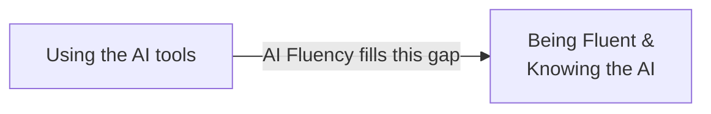

# AI Fluency: Framework & Foundations — My Notes

> Reference companion: [context.md](context.md)

## Introduction: AI Fluency

This part covers how we collaborate with AI system which acts as a companion or partner in solving real world problems.

Here AI acts as a companion, a innovative partner to solve the problems

> It is the ability to collaborate with AI in ways that are:  
> ✅ **Effective** &nbsp;&nbsp;|&nbsp;&nbsp; ⚡ **Efficient** &nbsp;&nbsp;|&nbsp;&nbsp; 🤝 **Ethical** &nbsp;&nbsp;|&nbsp;&nbsp; 🛡️ **Safe**

It works on the framework of 4D's - *Delegation, Description, Discrement, Deligence* 

| D | Question it answers |
|---|---|
| **Delegation** | What part does AI solve, what part do I solve, what part is collaborative? |
| **Description** | How do I communicate the problem & requirements to the AI? |
| **Discernment** | How do I validate / evaluate the AI's results? |
| **Diligence** | How do I stay transparent and accountable for what the AI system did? |

## Why AI Fluency?

- In current Era, technology is both exciting and uncertain
- Having AI systems in hand, which are capable of doing a variety of tasks - brain-storm, write email, chat support, build something
- Questions:
    - How do we get the most out of such a powerful tool?
    - How do we ensure, we use it responsibly?

- Gaps:
    - How do we validate that a solution built by AI is correct?
    - How do we use AI when the problem itself is not clear to us? or we do not know how to phrase it to AI?
    - What happens to the data we provide as input to these tools?

