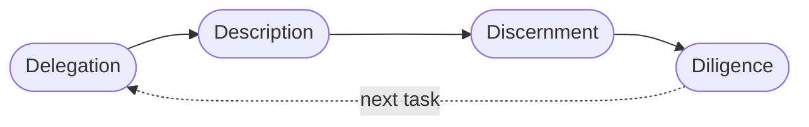
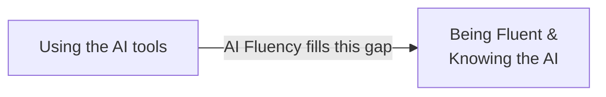

# AI Fluency: Framework & Foundations — My Notes

> Reference companion: [context.md](context.md)

## Introduction: AI Fluency

This part covers how we collaborate with AI system which acts as a companion or partner in solving real world problems.

Here AI acts as a companion, a innovative partner to solve the problems

> It is the ability to collaborate with AI in ways that are:  
> ✅ **Effective** &nbsp;&nbsp;|&nbsp;&nbsp; ⚡ **Efficient** &nbsp;&nbsp;|&nbsp;&nbsp; 🤝 **Ethical** &nbsp;&nbsp;|&nbsp;&nbsp; 🛡️ **Safe**

It works on the framework of 4D's - *Delegation, Description, Discrement, Deligence* 

| D | Question it answers |
|---|---|
| **Delegation** | What part does AI solve, what part do I solve, what part is collaborative? |
| **Description** | How do I communicate the problem & requirements to the AI? |
| **Discernment** | How do I validate / evaluate the AI's results? |
| **Diligence** | How do I stay transparent and accountable for what the AI system did? |

## Why AI Fluency?

- In current Era, technology is both exciting and uncertain
- Having AI systems in hand, which are capable of doing a variety of tasks - brain-storm, write email, chat support, build something
- Questions:
    - How do we get the most out of such a powerful tool?
    - How do we ensure, we use it responsibly?

- Gaps:
    - How do we validate that a solution built by AI is correct?
    - How do we use AI when the problem itself is not clear to us? or we do not know how to phrase it to AI?
    - What happens to the data we provide as input to these tools?

## Interact With AI Systems

You will follow either of the way listed below to interact with AI systems:

1. *Automation* - You give prompts as input to AI and in return it does something and generates the result.

2. *Augmentation* - You and AI work together to a get a task done. Example - Brainstorm to understand domain. Another can be to work together to build a tool.

3. *Agency* - AI works as an independent unit without you and on your behalf.

## 4D Framework

1. **Delegation**
    - Thoughtfully deciding what work to do with AI vs. doing yourself
    - Understand the problem - *Goals*, outcomes and how the success looks like
    - You should know the *capacity* and *limitation* of the AI system
    - Decide what AI does well and what it cannot
    - Divide the tasks between *Yourself* and *AI*

2. **Description**
    - Communicating clearly with AI systems
    - Prompts include: final output, structure of the output
    - Role AI will play
    - Approach AI needs to follow
    - Try to provide *context* as much as possible
    - Input examples

3. **Discernment**
    - Evaluating AI outputs and behavior with a critical eye
    - Check is the output useful and valid?
    - Check is AI taking the right path or approach?

4. **Diligence**
    - Ensuring you interact with AI responsibly
    - Measure accuracy of the output
    - Take the ownership and responsibility of the AI work
    - Ethical use and transparency

## Exercise 1: Apply the 4D's

> Pick one of these collaboration scenarios and consider how you might apply the 4D Framework.

**Scenario used:** Control-M batch monitoring tool (support team job monitoring + on-demand re-run tied to
a ticket, dev team filtered sanity-check view, full audit trail) — a real project, used instead of the
course's Communication/Research/Creative options.

| D | Answer |
|---|---|
| **Delegation** | Judgment work — HLD/LLD design, test strategy/guardrails, user sign-off — stays human. Coding implementation, and validating it against the pre-defined tests, goes to AI. |
| **Description** | Brief AI with the design docs (HLD/LLD), Control-M API/swagger doc, and test-strategy doc, plus a clear role and workflow context — so "what," "how," and "how good" are all covered by real documents, not just prose. |
| **Discernment** | Layered trust: does it pass the (human-defined) test suite → does it run cleanly in UAT → does a human review round confirm all features behave as expected. |
| **Diligence** | Log decisions/assumptions made during build (traceable to HLD/LLD) for root-cause tracing later. Runtime risk is low because the shipped tool is deterministic/rule-based, not an AI making live judgment calls — so the audit table fully accounts for every action once deployed. |

**Review:** Strong, self-consistent answer set — each D reinforces the others (e.g. Discernment's "passes
the tests" only works because Delegation kept test-authorship human, not AI-graded); sharpest insight was
separating *build-time* AI uncertainty from *runtime* determinism in the Diligence answer. Gap to revisit
later: Diligence only covered internal traceability, not external disclosure (did the teams using this tool
get told it was AI-assisted?).
