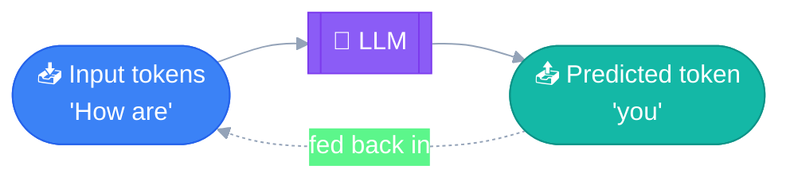
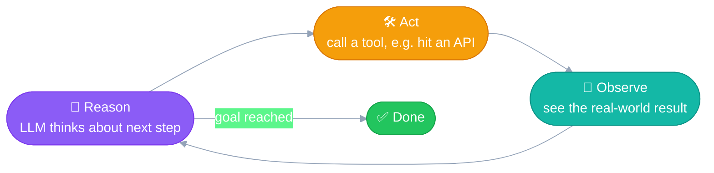
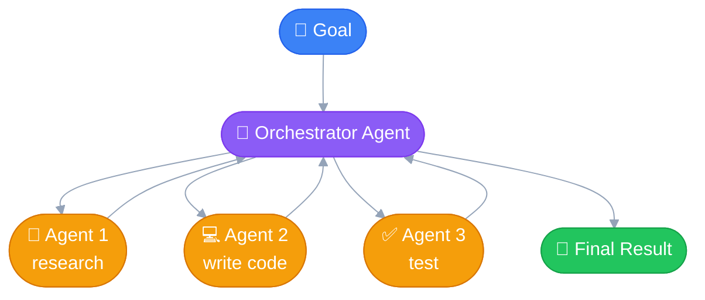
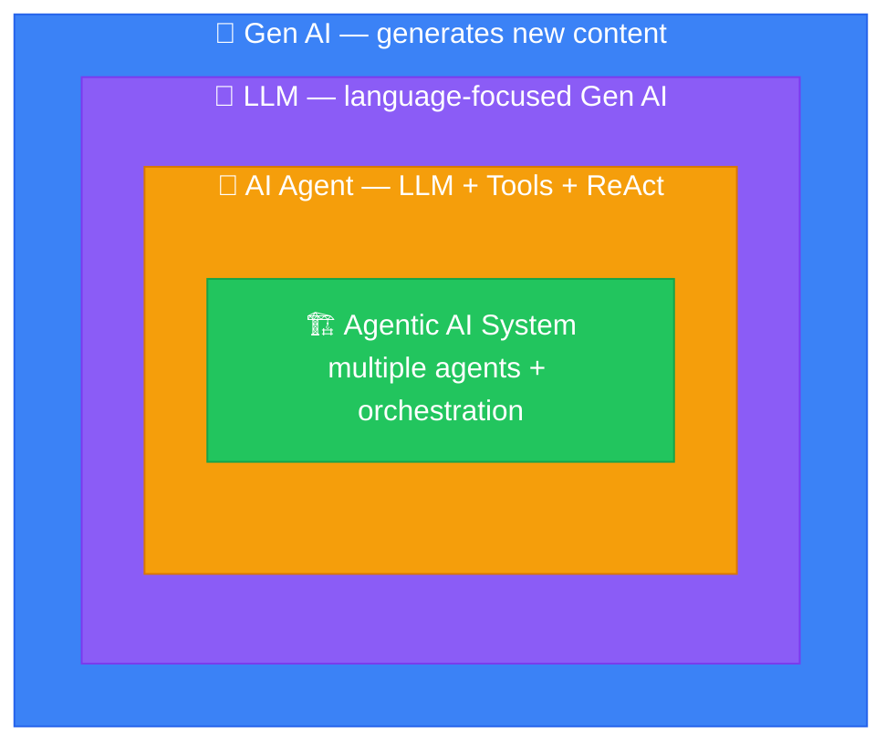
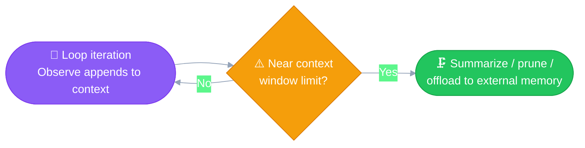
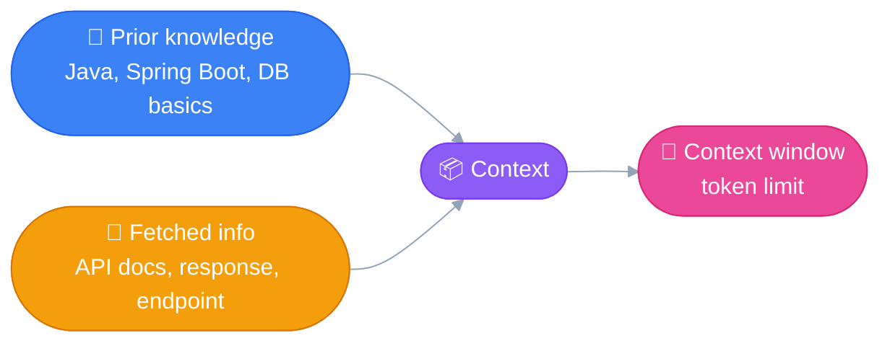
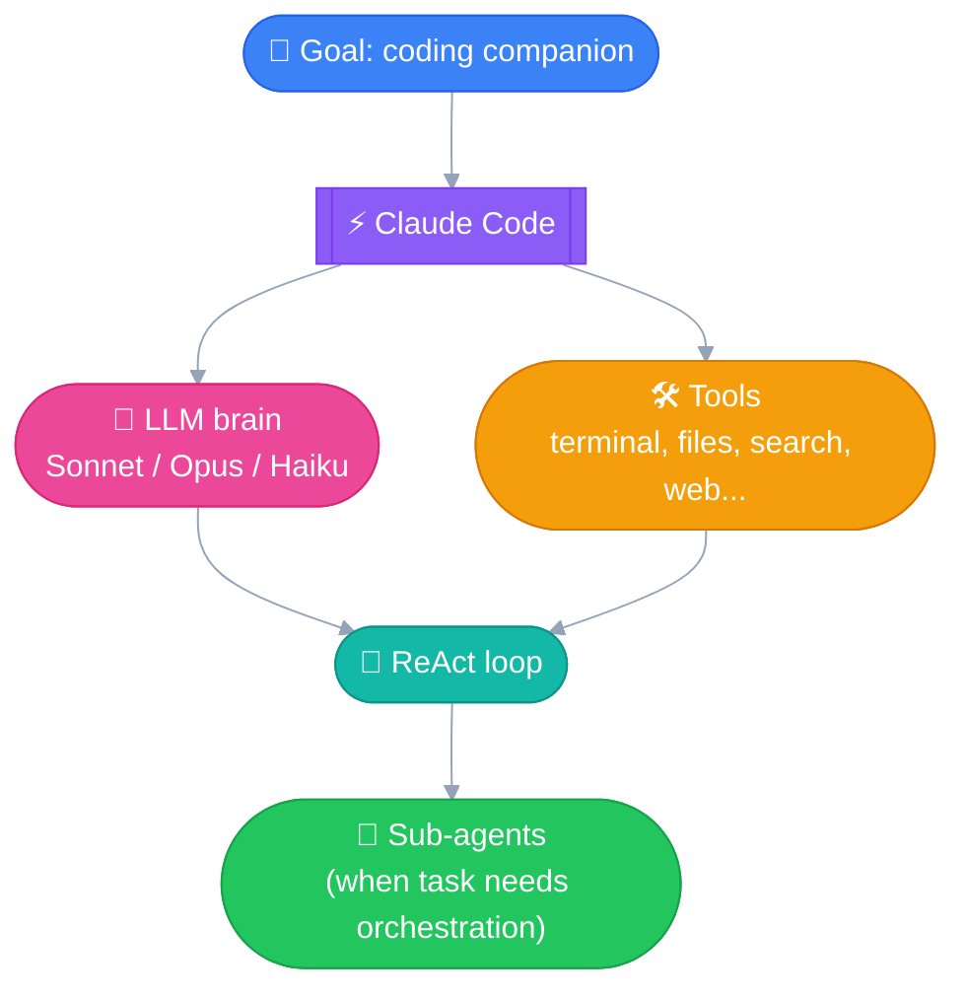
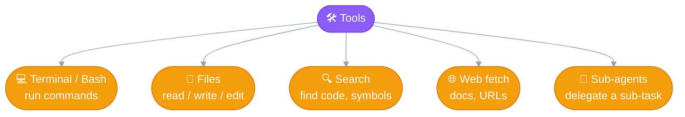

# Foundations: Gen AI, AI Agents & Context
---

Vocabulary and mental models that everything else in this module builds on —
Gen AI / LLM / AI Agent / Agentic AI System, and what "context" means.

## Introduction: Gen AI vs AI Agent vs Agentic AI

Before getting into Claude Code, here's the basic vocabulary. Claude Code itself
is an **AI Agent** that helps write code as per prompts — everything below sets
up that context.

### 1. Gen AI (Generative AI)

The field of AI that **generates new content** (text, images, audio, code)
instead of just analyzing/classifying existing data.

- **LLM (Large Language Model)** is a sub-field of Gen AI, focused on language.
- Core trick: predict the next token based on the sequence seen so far.
  - `"How are ___?"` → `"How are you?"`
- Classic shape: text in → text out (modern LLMs are increasingly multimodal).

### 2. AI Agent

An LLM alone just answers once. An **AI Agent** wraps an LLM with the ability
to **take actions** and **use their results** to decide what to do next.

> AI Agent = LLM (brain) + Tools (hands) + a loop to reason → act → observe

This loop is called **ReAct** (Reason + Act):

Note: this looks similar to how a transformer generates tokens one at a time
and feeds them back in — but that loop happens *inside* one LLM call
(token-by-token, no real-world action). ReAct is the *outer* loop — each
"Reason" step is a full LLM call, and "Act" touches the real world (APIs,
code execution, files, etc.).

### 3. Agentic AI System

An application built using one or more AI Agents to autonomously achieve an
end goal. With just one agent, no orchestration is needed. With **multiple
agents**, something needs to coordinate who does what and in what order —
this is called **orchestration**.

### Quick summary

| Term | What it is |
|---|---|
| Gen AI | Field of AI that generates new content |
| LLM | Gen AI model specialized in language (next-token prediction) |
| AI Agent | LLM + Tools + ReAct loop (reason → act → observe) |
| Agentic AI System | App built from one or more agents, orchestrated to reach a goal |

*(Note to self: agent-to-agent communication and MCP are separate topics —
covering later.)*

### How the four terms nest

## Context & Context Window

### Real-world analogy first

Say I'm building an API that consumes movie reviews from an open-source
platform, in Java + Spring Boot, saving results to a DB. To do this task I
need information like: API endpoint, auth mechanism, request/response
format, status codes, which response fields actually matter, plus general
know-how (Java, Spring Boot, how to persist to a DB).

That information splits into two kinds:

- **Already "in my head" (prior knowledge)** — Java, Spring Boot, DB basics,
  general REST conventions. I didn't have to go fetch this for today's task,
  I already know it.
- **Task-specific (have to go fetch it)** — this particular API's endpoint,
  auth scheme, response schema, rate limits. I don't know these until I
  *actually go read the docs / make a test call*.

Importantly: knowing Java doesn't help until it's *applied*, and the API's
auth mechanism isn't useful to me until I've *actually read it* — merely
being capable of looking it up doesn't count, only what's actually in front
of me while I work does.

### Deriving the actual term

**Context** = the specific information currently available to act on a
task. Some of it is prior/baked-in knowledge, some has to be actively
fetched (docs, files, API responses) — but either way, it only counts as
context once it's actually loaded and in front of you (or, for an agent, in
its context window).

For an AI Agent, context = prompts, conversation history, tool/observation
outputs, file contents it has read, etc. It's the agent's **working
memory for the current task** — not persistent long-term memory. Once the
session ends (or older content gets dropped/summarized), that memory is
gone unless something outside the model preserves it (a file, a DB, a
saved summary).

**Context window** = the hard limit (measured in tokens) on how much
context the model can hold at once. Everything competing for that budget —
system prompt, conversation history, tool definitions, tool outputs — counts
against the same limit.

In an agent's ReAct loop, context **grows with every loop iteration** —
each "Observe" step appends its result to context before the next "Reason"
step. That's exactly why long-running agents eventually approach the
context window limit and need strategies like summarization, pruning old
tool outputs, or offloading to external memory.

Zooming back out to where that context actually comes from, in the movie-review
example:

## What is Claude Code?

**Goal:** have a companion that helps write code.

Claude Code is an **AI Agent** — and can behave like an **Agentic AI System**
when it delegates work to sub-agents. It's built from the same pieces covered
above:

- **Brain**: an LLM — Sonnet / Opus / Haiku
- **Hands**: Tools — terminal commands, file read/write/edit, search, web
  fetch, and even spawning sub-agents for bigger tasks
- **Operating pattern**: the ReAct loop (reason → act → observe → repeat)

### Tools, zoomed in

