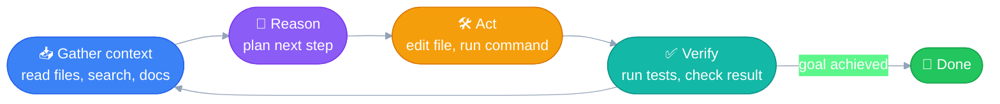
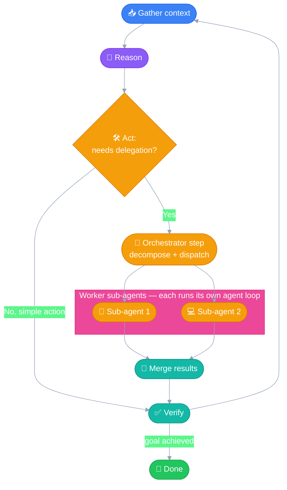
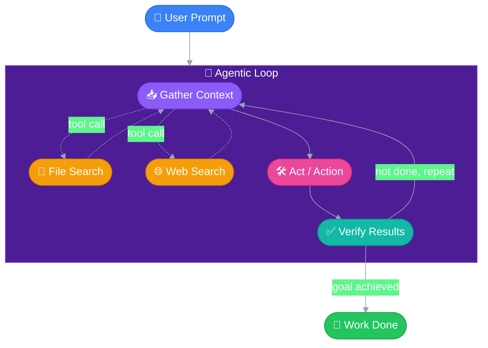

# How Claude Code Works
---

Builds on [00_foundations.md](00_foundations.md) — the ReAct loop and Agentic
AI System concepts. This file covers the specific loop Claude Code runs
internally, and how it can nest a workflow pattern inside that loop.

## 1. The Agent Loop

Every AI Agent needs some strategy to go from "goal" to "done." Claude Code's
strategy is **the agent loop** — a specialized version of the ReAct pattern
covered in foundations.

## 2. Claude Code's loop = ReAct, specialized for coding

Plain ReAct: **Reason → Act → Observe → repeat.**

Claude Code's version: **Gather context → Reason → Act → Verify → repeat**
until the goal is achieved.

Two differences from textbook ReAct, both coding-specific:

- **Gather context is its own explicit step**, not folded silently into
  Reason — because for a coding agent, getting context (reading files,
  searching the codebase, checking docs) is itself an action, not passive
  thinking. Context has to be actively fetched (see
  [00_foundations.md](00_foundations.md#context--context-window)), it
  doesn't just appear.
- **Verify is stricter than Observe.** Observe just means seeing a result;
  Verify means actively checking the result is *correct* — running tests,
  re-reading a diff, checking output — before deciding the step succeeded.

## 3. Workflow vs. Agent Loop

Two different ways an AI system can move through steps to reach a goal:

| | Workflow | Agent Loop |
|---|---|---|
| Control flow | Predefined by the developer — fixed code path | Decided dynamically by the LLM at runtime |
| Predictability | High — good for well-understood tasks | Low — needed when steps can't be known in advance |
| Named patterns | Prompt chaining, Routing, Parallelization, Orchestrator-workers, Evaluator-optimizer | The ReAct / agent loop itself |

Claude Code is built as an **agent loop**, not a fixed workflow — because the
right sequence of file reads/edits/tests for a given coding task can't be
predicted ahead of time.

## 4. How the two combine

Workflow patterns and the agent loop aren't competing choices — **they
compose.** One "Act" step inside the agent loop can itself invoke a
workflow.

The clearest example: **spawning sub-agents.** When Claude Code delegates a
piece of work to a sub-agent, that single Act step *is* the
**orchestrator-workers** pattern — decompose the task, dispatch to worker(s),
merge results back. And each worker, once spawned, runs its *own* full agent
loop internally to complete its piece.

**The general principle:** an agent can choose, as one of its actions, to
invoke a workflow (fixed or dynamic). And a "worker" in that workflow can
itself be a full agent running its own loop — not just a single LLM call.
Nested, not either/or.

## 5. Internal structure, end to end

A simplified box view: prompt goes in, the Agentic Loop box is where all the
work happens (Gather Context calling out to tools, then Act, then Verify,
looping until the goal is met), and the result comes out.

