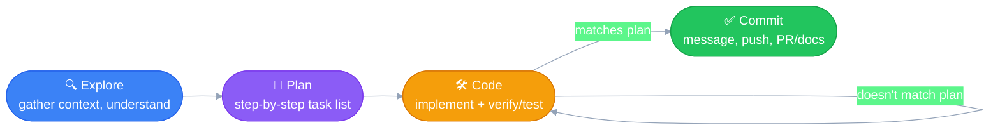

# Explore → Plan → Code → Commit
---

The recommended human-facing workflow for solving a real problem with
Claude Code. Builds on the agent loop in
[01_how_claude_code_works.md](01_how_claude_code_works.md) — same shape,
different granularity (see note at the end).

## The four stages

**Explore** — gather context, understand the problem. No solutioning yet,
no code. What is the expectation? What does success actually mean here?

**Plan** — turn that understanding into a concrete, step-by-step plan
(pseudocode / a flowchart of tasks). This is a distinct mental gear-shift
from Explore: Explore is "what's true right now," Plan is "what am I
going to do about it." Still not the actual implementation — just the list
of tasks that, once done, mark the goal achieved.

**Code** — implement the plan. Follows the context and steps built during
Plan. Includes checking your own work as you go: verify against the plan,
run tests, and repeat until the result matches the expected outcome.

**Commit** — package the validated result: a clear commit message, push,
and (where relevant) a PR / doc or changelog update.

## Same shape as the agent loop, coarser granularity

This isn't a new pattern — it's the **agent loop** from
[01_how_claude_code_works.md](01_how_claude_code_works.md), just applied at
the scale of a whole human task instead of a single tool call:

| Agent loop (per tool call) | Explore-Plan-Code-Commit (per task) |
|---|---|
| Gather Context | Explore |
| Reason | Plan |
| Act | Code |
| Verify | Verify, folded inside Code (test/check as you go) |
| repeat until goal achieved | repeat Code until it matches the Plan |
| — | Commit (packaging step, no agent-loop equivalent) |

The agent loop runs this cycle many times per second internally, at the
level of individual actions. Explore-Plan-Code-Commit is you, the human,
running the *same shape* of loop once, deliberately, at the level of an
entire task — which is exactly why it's a good habit: it's the same
discipline that already makes the agent effective, applied to how you
direct it.
