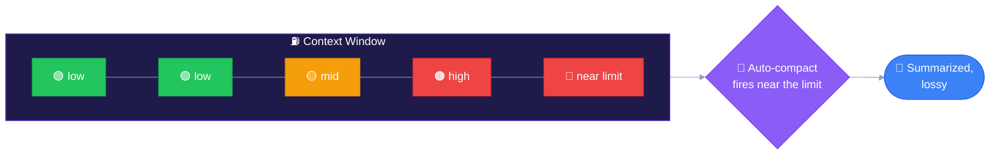
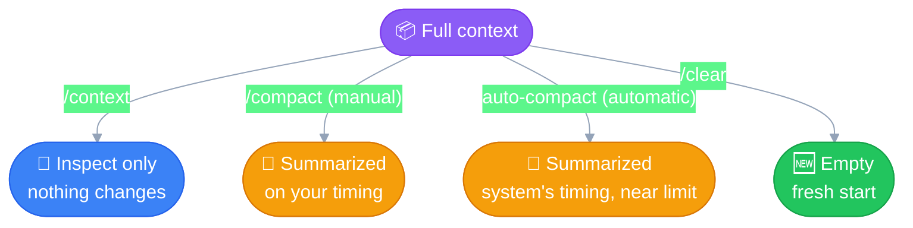
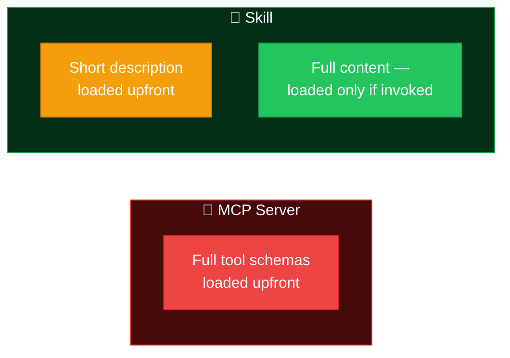
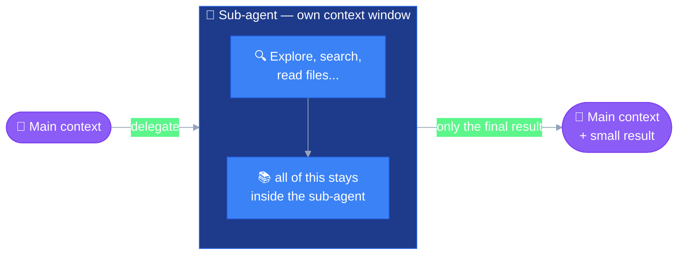

# Context Management
---

Context is a **budget**, not a bottomless bag. Everything that participates
in a task — prompt, tool calls, tool results, file contents, past turns —
gets added to it and takes up space in the
[context window](00_foundations.md#context--context-window). This file
covers the tools to **inspect**, **spend**, and **reclaim** that budget.

## 1. The fuel gauge

Think of the context window like a fuel tank that only fills up, never
empties on its own, until you take an explicit action.

Nothing frees up space by itself — the tank only drains through one of the
three commands below, or by auto-compact stepping in when you're about to
run dry.

## 2. The three commands

| Command | What it does | When to reach for it |
|---|---|---|
| **`/context`** | Inspect only — shows what's consuming the window and how full it is (system prompt, tool defs, conversation, etc.) | Anytime you want a read before deciding whether to act |
| **`/compact`** | Summarize the conversation so far, trading detail for space, **on your own timing** | Long session that's still going, but you don't need the full blow-by-blow history anymore |
| **`/clear`** | Wipe the context entirely, start with a blank slate | Starting an unrelated task, or want zero bias from prior turns |

**Important nuance:** `/compact` doesn't *keep* the past work history intact
— it **summarizes** it. That's a lossy operation: it preserves the gist, not
every detail. Auto-compact (the system doing this for you as you approach
the limit) is the *exact same mechanism*, just triggered automatically
instead of on your command — and it fires *before* the limit is truly hit,
since compacting itself needs some working room to run in.

## 3. Spending the budget wisely

Two levers that reduce how fast the tank fills in the first place —
different from the three commands above, which act *after* the fact.

### Pay for what you use, not what you might use

**MCP servers** load their full tool definitions into context **upfront**,
whether you end up using them or not — every connected server is a fixed
tax on the window from turn one.

**Skills** are lazy: only a short description loads upfront; the full
content only loads into context **when actually invoked**.

**Practical move:** turn off MCP servers you're not actively using for the
task at hand — each one left on is a fixed cost you're paying regardless of
value delivered.

### Isolate exploration with sub-agents

A sub-agent gets its **own separate context window**. Whatever it reads,
searches, or tries stays inside its own tank — only the **final result**
gets merged back into the main conversation's context.

Same underlying idea as the MCP-vs-Skills point: **do the expensive,
detailed work somewhere it doesn't cost the main budget, and only pay for
the summary.**

## Summary

| Tool | Type | Effect |
|---|---|---|
| `/context` | inspect | Read-only, no change |
| `/compact` | reclaim | Manual summarization, lossy, your timing |
| auto-compact | reclaim | Same as `/compact`, system-triggered near the limit |
| `/clear` | reclaim | Full reset, no history carried forward |
| Disabling unused MCP servers | spend less upfront | Removes a fixed per-turn tax |
| Skills over MCP where possible | spend less upfront | Lazy-loaded, pay only on invocation |
| Sub-agents | spend less upfront | Isolate exploration in a separate window, merge back only the result |
