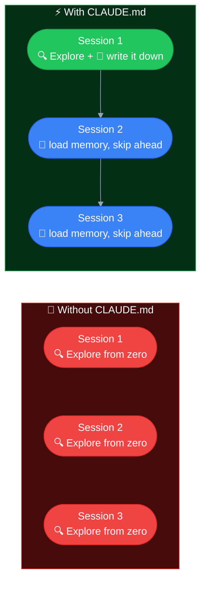
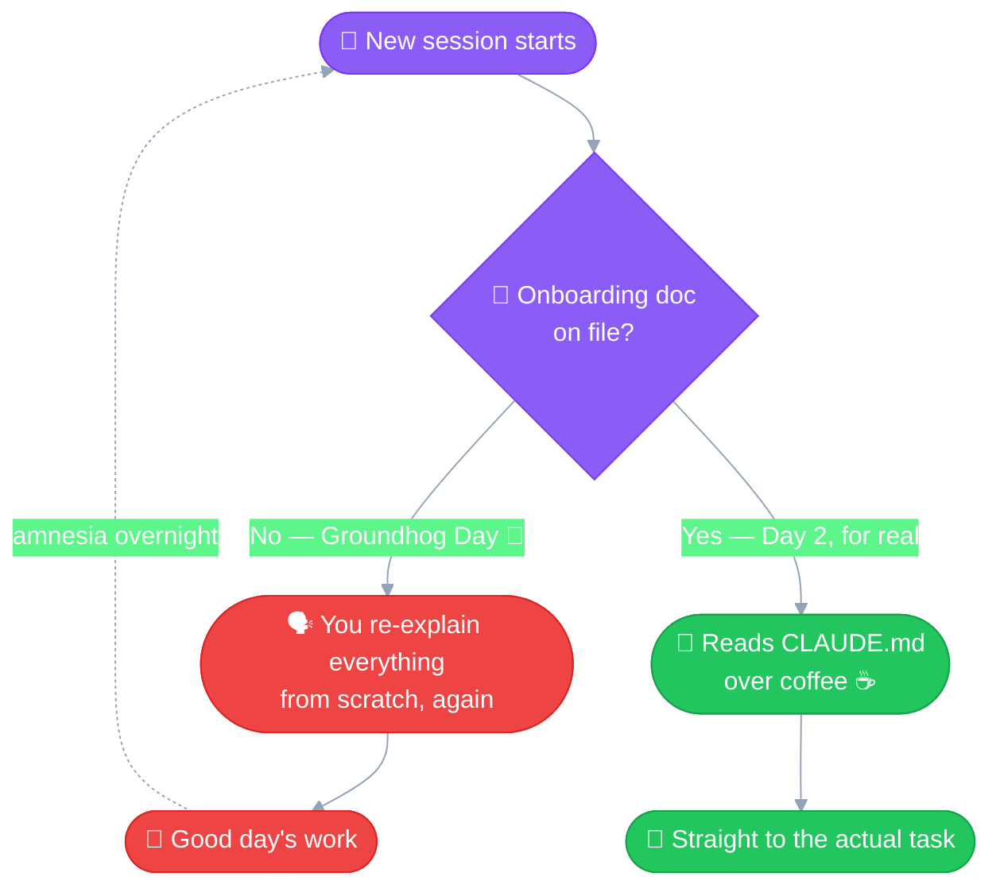
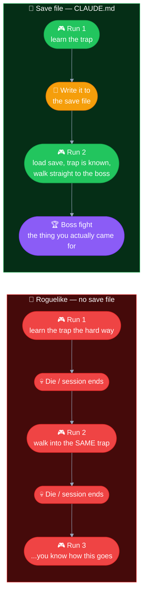
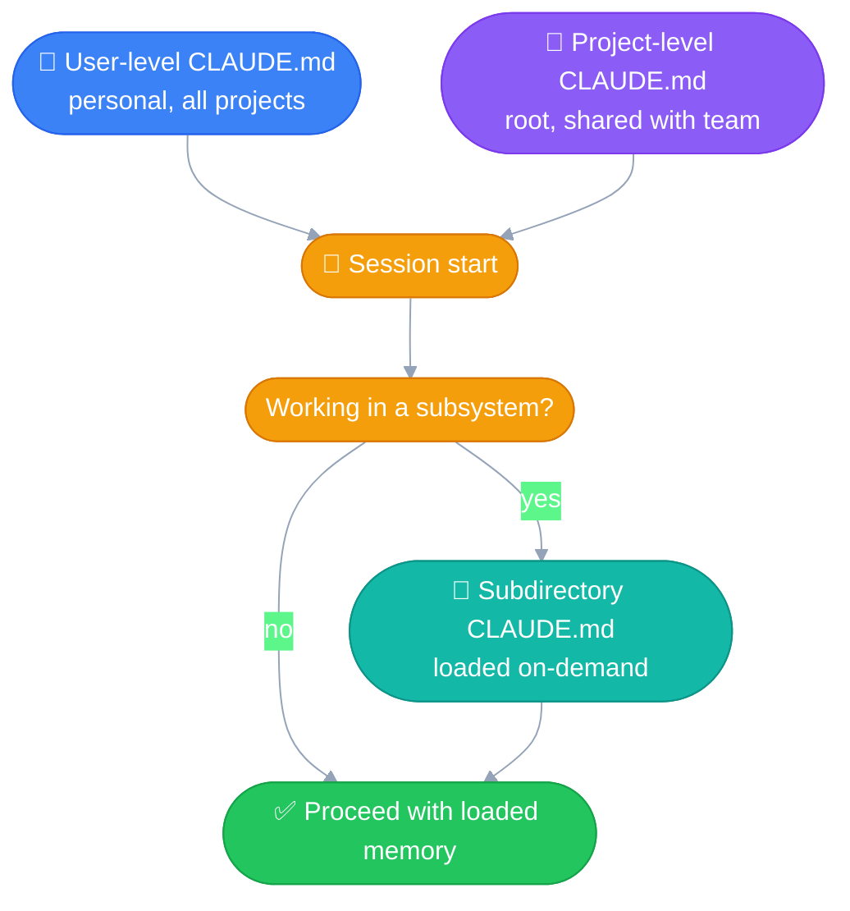

# CLAUDE.md
---

File-based **persistent memory** for Claude Code. Set once, reused across
every subsequent session — instead of re-explaining the same things, or
Claude re-discovering them, every single time.

## The problem it solves

Without CLAUDE.md, every new session re-runs the **Explore** stage of
[Explore → Plan → Code → Commit](02_explore_plan_code_commit.md) from
scratch — the same brainstorming, the same discovery, for things that
haven't changed since last time (conventions, setup steps, known gotchas).

CLAUDE.md lets you **skip re-Exploring** the stable stuff, so a new session
can jump straight past repeated discovery into the actual task.

The real win isn't just speed — it's **consistency**, and one more thing
that matters even more: **it removes guesswork.** Without it, anything not
explicitly stated has to be *inferred* — your conventions, why a strange
workaround exists, what "done" actually means here — and an inference can
simply be wrong. CLAUDE.md turns those from guesses into stated fact, so
the agent acts on what you actually meant instead of its best guess at it.

### The "new employee, every single day" analogy

Without CLAUDE.md, every session is like hiring a brilliant new employee who
shows up knowing nothing about the company, gets a full onboarding briefing
from you, does great work all day — and then wakes up tomorrow with total
amnesia. Same briefing, same day, forever. 🔁

CLAUDE.md is the **onboarding doc** that new employee reads *before* their
first coffee — so day 2 starts as day 2, not day 1 again.

### Or, if you'd rather think in video-game terms: it's the save file

No CLAUDE.md = a roguelike. Die (close the session), respawn at Level 1,
every single run — full inventory wiped, boss fight forgotten, that one
trap you learned about the hard way? Walking into it again.

CLAUDE.md = a **save point**. Load the file, spawn back in with your gear,
your map, and the scars you already earned — and go straight for the boss
you're actually here to fight.

Every session without CLAUDE.md is a fresh character select screen. Every
session *with* it is a continue button.

## What goes in it

- Project conventions, setup/build/test commands, codebase structure
- Personal preferences (how you like things done)
- Known gotchas: root cause + solution for problems that tend to recur, so
  you don't re-debug the same thing twice

## The levels

| Level | Location | Scope |
|---|---|---|
| **Project** | root of the repo | Shared with the team (usually checked into version control) |
| **User** | user's home profile | Personal, applies across *all* projects |
| **Subdirectory** *(bonus)* | anywhere deeper in the repo | Loaded on-demand only when working in that part of the codebase — useful when a subsystem has its own conventions |

## Quick-add shortcut

Typing `#` at the start of a message in Claude Code appends whatever
follows straight into the memory file — handy for capturing a root-cause
note the moment you hit it, without manually opening and editing the file.

## Same pattern, different tool

This is the same idea as Claude's own general memory system (project/user
level files, loaded automatically so context doesn't need to be rebuilt
from scratch each session) — just applied specifically inside Claude Code.
