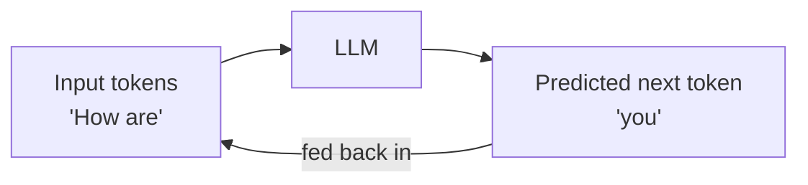
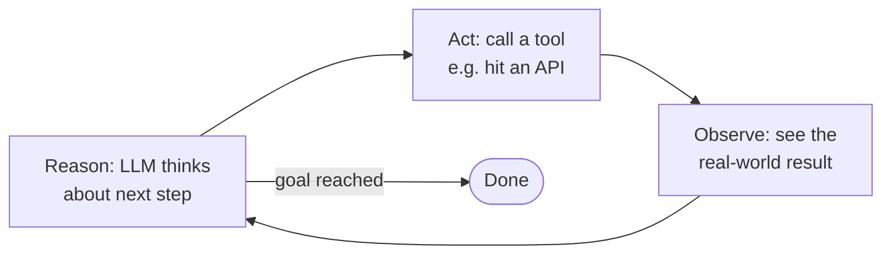
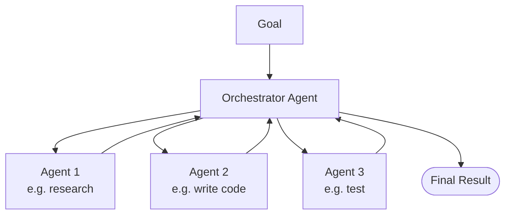

# Claude Code 101
---

## Introduction: Gen AI vs AI Agent vs Agentic AI

Before getting into Claude Code, here's the basic vocabulary. Claude Code itself
is an **AI Agent** that helps write code as per prompts — everything below sets
up that context.

### 1. Gen AI (Generative AI)

The field of AI that **generates new content** (text, images, audio, code)
instead of just analyzing/classifying existing data.

- **LLM (Large Language Model)** is a sub-field of Gen AI, focused on language.
- Core trick: predict the next token based on the sequence seen so far.
  - `"How are ___?"` → `"How are you?"`
- Classic shape: text in → text out (modern LLMs are increasingly multimodal).

### 2. AI Agent

An LLM alone just answers once. An **AI Agent** wraps an LLM with the ability
to **take actions** and **use their results** to decide what to do next.

> AI Agent = LLM (brain) + Tools (hands) + a loop to reason → act → observe

This loop is called **ReAct** (Reason + Act):

Note: this looks similar to how a transformer generates tokens one at a time
and feeds them back in — but that loop happens *inside* one LLM call
(token-by-token, no real-world action). ReAct is the *outer* loop — each
"Reason" step is a full LLM call, and "Act" touches the real world (APIs,
code execution, files, etc.).

### 3. Agentic AI System

An application built using one or more AI Agents to autonomously achieve an
end goal. With just one agent, no orchestration is needed. With **multiple
agents**, something needs to coordinate who does what and in what order —
this is called **orchestration**.

### Quick summary

| Term | What it is |
|---|---|
| Gen AI | Field of AI that generates new content |
| LLM | Gen AI model specialized in language (next-token prediction) |
| AI Agent | LLM + Tools + ReAct loop (reason → act → observe) |
| Agentic AI System | App built from one or more agents, orchestrated to reach a goal |

*(Note to self: agent-to-agent communication and MCP are separate topics —
covering later.)*

## What is Claude Code?

Claude Code is an **AI Agent** that helps write code based on prompts.

## Reference Links:

- Skill Course: https://anthropic.skilljar.com/claude-code-101/469788

