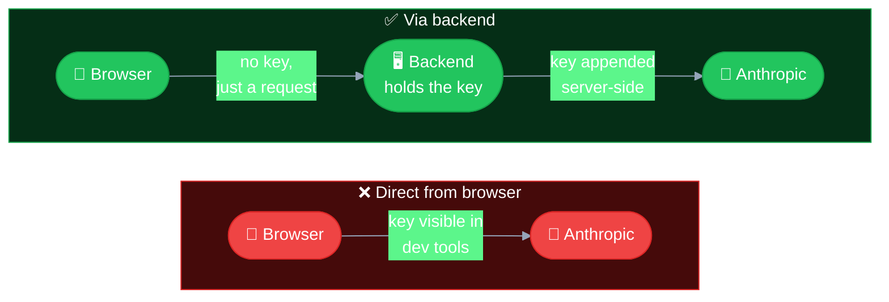
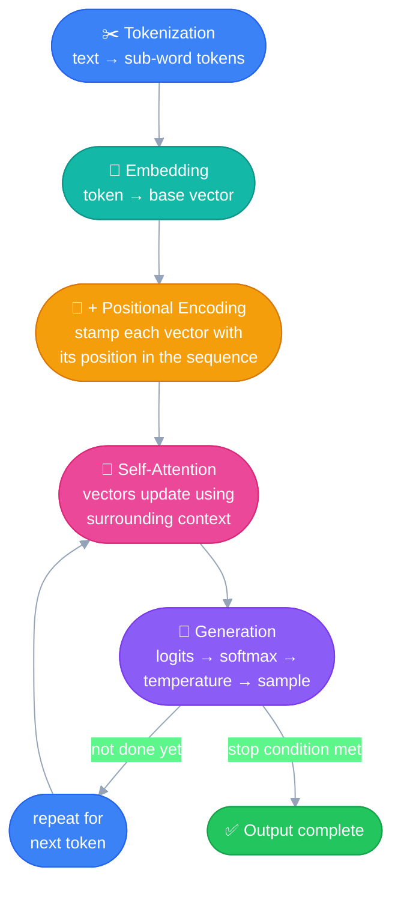
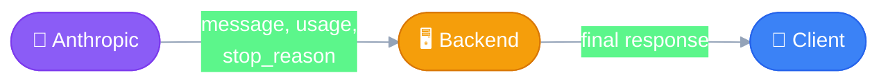
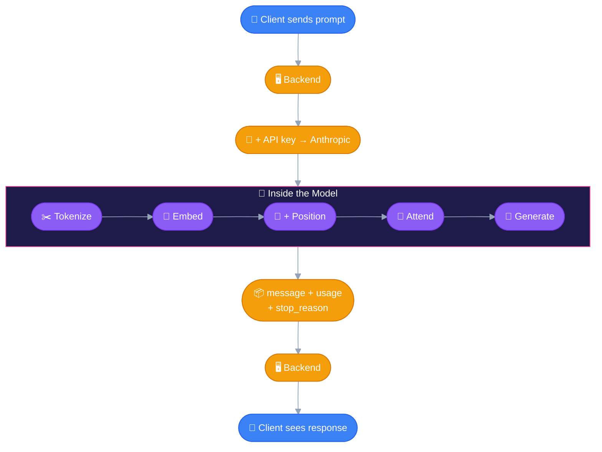

# Accessing the API
---

Half backend engineering, half AI internals — this topic is the full
round trip of a single prompt: from a click in a browser, through your
own backend, into Anthropic's model, and back. Think of it as **one relay
race with 5 legs** — and leg 3, inside the model itself, is a relay race
of its own.

## 🏁 The Big Picture — 5 Legs of the Relay

```mermaid
%%{init: {"theme": "base", "themeVariables": {"primaryColor": "#8B5CF6", "primaryTextColor": "#ffffff", "primaryBorderColor": "#7C3AED", "lineColor": "#94A3B8", "fontFamily": "Segoe UI, sans-serif", "fontSize": "15px"}, "flowchart": {"htmlLabels": true, "padding": 20, "nodeSpacing": 35, "rankSpacing": 60}}}%%
flowchart LR
    C(["🧑 Client<br/>'Hello, how are you?'"]) --> B1(["🖥️ Backend<br/>receives request"])
    B1 --> A1(["🔐 Backend → Anthropic<br/>+ API key"])
    A1 --> M(["🧠 Anthropic model<br/>processes it"])
    M --> A2(["📦 Anthropic → Backend<br/>generated output"])
    A2 --> B2(["🖥️ Backend → Client<br/>final response"])
    B2 --> U(["🧑 Client sees<br/>'I am good, how may I help?'"])

    classDef client fill:#3B82F6,stroke:#2563EB,color:#ffffff
    classDef backend fill:#F59E0B,stroke:#D97706,color:#ffffff
    classDef model fill:#8B5CF6,stroke:#7C3AED,color:#ffffff
    class C client
    class U client
    class B1 backend
    class B2 backend
    class A1 backend
    class A2 backend
    class M model
```

Every request looks the same underneath: **two backend systems talking
over REST.** No magic in the transport — the magic is what happens inside
leg 3.

## 🔒 Leg 1 — Why There's a Backend Hop At All

> [!IMPORTANT]
> ### The API key must never reach the browser
>
> - Frontend code is visible to anyone using the browser's dev tools —
>   anything shipped to the client can be read by the client.
> - If the API key lived in frontend code, anyone could lift it and make
>   unauthenticated (well — *stolen-authenticated*) requests on your
>   dime.
> - **The fix:** the backend holds the key securely and appends it to
>   every outbound request. The client never sees it, never touches it.

## 📨 Leg 2 — Backend Calls Anthropic

Two ways to make the call: Anthropic's **SDK**, or a plain **HTTP REST**
request. Either way, the request has the same shape:

| Where it lives | Field | What it is |
|---|---|---|
| **Header** | API key (`x-api-key`) | Authenticates the caller — travels in the request header, not the body |
| **Body** | `model` | Which tier — Opus / Sonnet / Haiku ([see model overview](00_model_overview.md)) |
| **Body** | `messages` | The client's input/prompt |
| **Body** | `max_tokens` | A cap on this request's *output* length |

> [!WARNING]
> ### `max_tokens` is not the same thing as the context window
>
> - **`max_tokens`** — a per-request cap you set on how long *this
>   response* is allowed to be.
> - **Context window** — the model's total capacity (input + history +
>   output combined), a fixed property of the model itself, not
>   something you set per request. See
>   [Claude Code 101 → Context & Context Window](../_01_claude_code_101/00_foundations.md#context--context-window)
>   for the full picture.
>
> `max_tokens` limits one slice of what fits inside the window — it
> isn't the window.

## 🧠 Leg 3 — Inside the Model (a relay of its own)

This is where the transformer architecture actually does its work. Four
named stages, but with one important internal correction: **positional
encoding happens early, folded into embedding — not as its own late
step.**

### ✂️ Tokenization
Break input text into smaller chunks — in practice, **sub-word pieces**,
not always whole words (so an unfamiliar word can still be represented
as a combination of known fragments — this is also what handles
"words the model has never seen," not attention).

### 🔢 Embedding
Convert each token into a numerical vector representing its base
semantic meaning. Computers can't work with raw text — only numbers.

### 📍 Positional Encoding
Stamps each embedding with **where it sits in the original sequence**,
so the model preserves word order. Added at this stage, combined with
the embedding, *before* attention runs.

> [!NOTE]
> ### Don't confuse this with self-attention
> Positional encoding solves a completely different problem than
> contextual meaning:
> - **Positional encoding** → preserves *order* ("dog bites man" ≠ "man
>   bites dog").
> - **Self-attention** (next step) → resolves *meaning* using context
>   (river-bank vs. money-bank).
>
> One is about sequence, the other is about semantics — both necessary,
> neither one substitutes for the other.

### 👀 Self-Attention — the breakthrough
This is *the* mechanism that made modern LLMs possible — introduced in
Google's 2017 paper *"Attention Is All You Need."* Before it, embeddings
were static: "bank" got the exact same vector every time, regardless of
context. Self-attention lets each token's vector get **transformed**
based on its relationship to every other token around it — same
starting point, different ending point depending on what's nearby.

It's also what let LLMs scale to today's sizes: unlike the older
sequential (RNN/LSTM) approach, which processed one word at a time and
struggled to "remember" far-back context, attention computes
relationships across the whole sequence **in parallel**.

### 🎲 Generation
The final layer produces a raw score (**logit**) for every possible next
token. Not yet a probability — that comes from **softmax**, which
converts the logits into a proper probability distribution.

**Temperature** is applied at this step — not a network layer, a
*decoding-time* dial:
- Low temperature → sharpens the distribution, favors the most likely
  token, more deterministic output.
- High temperature → flattens the distribution, gives less-likely
  tokens a real shot, more varied/creative output.

A token gets sampled from that distribution, and the whole cycle
(re-run attention over the sequence-so-far, generate the next logit)
repeats — until a **stop condition**: `max_tokens` reached, an
end-of-sequence token, or a stop condition set in the prompt.

## 📬 Legs 4 & 5 — Response Back to the Client

| Field | What it holds |
|---|---|
| `message` | The generated output text |
| `usage` | Input token count + output token count |
| `stop_reason` | Why generation stopped (max tokens hit, natural end, stop sequence) |

The backend passes this straight through to the client, which renders it
— the `"Hello, how are you?"` → `"I am good, how are you? How may I
help?"` exchange, end to end.

## 🗺️ Full Relay, One Diagram

One prompt in, one relay race through five legs (with a five-leg race
of its own hidden inside leg 3), one answer back out.
