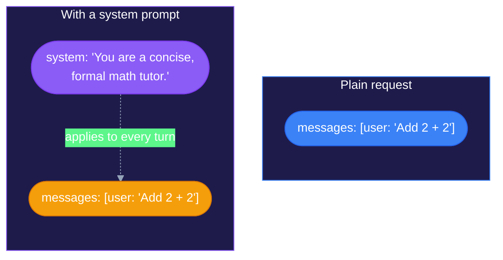
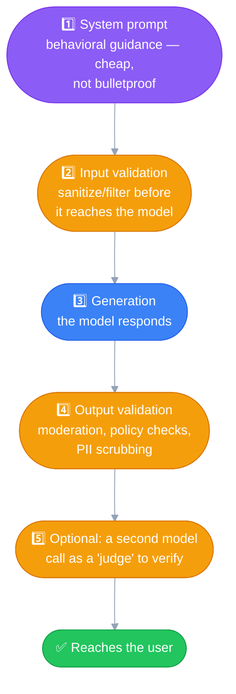

# System Prompts
---

## Plain user prompts vs. system prompts

A plain user prompt is just a task request — no behavioral framing:

- `"Add two numbers: 2 + 2"`
- `"What is hello in Hindi?"`

There's no instruction about *how* to respond, what role to play, or
what's off-limits. A **system prompt** adds exactly that layer: a
persistent instruction defining what's expected of the model — what it
can do, what it shouldn't, and how it should behave (tone, style,
persona) — in short, **what human role and responsibilities it should
replicate.**

## Structurally: a separate parameter, not another message

The system prompt is **not** part of the `messages` list (the user/
assistant turns). It's passed as its own distinct `system` parameter in
the API call — it never shows up as a "turn," and it isn't tagged with
a `role` the way user/assistant messages are.

## Applies to every turn, not a one-off instruction

Since the system prompt gets re-sent with every request (same as the
message history from
[Multi-Turn Conversations](02_multi_turn_conversations.md)), it
consistently shapes **every** response in the conversation — not just
the first one. Compare that to burying "be formal and concise" inside a
single user message: that instruction can get diluted or ignored as the
conversation moves on. A system prompt keeps re-asserting itself every
turn.

## Who sets it, and what goes in it

Defined on the backend/in app config — common for all chat requests
that application sends, not something the end user types per-message.
Beyond tone/style, it's also where persona details, domain knowledge,
or company-specific facts belong, so that context doesn't need
repeating in every user message:

> *"You are a support agent for Acme Corp. Acme sells X, Y, Z. Always
> respond in a friendly, concise tone. Never discuss pricing — direct
> users to sales@acme.com for that."*

> [!NOTE]
> ### With system prompts, we shape the response the LLM generates
> That's the core idea in one line — a system prompt is influence over
> *how generation happens*, applied consistently across the whole
> conversation.

## Guardrails — yes, but a *soft* one

System prompts are one of the most common places to put guardrail-style
rules: "don't discuss competitors," "refuse requests about X," "stay
within scope Y." Genuinely useful, widely-used pattern.

> [!WARNING]
> ### Strong influence, not a hard-enforced boundary
> A system prompt is probabilistic guidance, not code. The model tries
> hard to follow it, but — unlike an `if` statement, which physically
> cannot be argued with — a system prompt can potentially be pushed
> around by a sufficiently adversarial user message (prompt injection,
> jailbreak attempts). Don't treat it as the *only* line of defense
> when the stakes are real.

Production systems that need real guarantees stack multiple layers,
not just the system prompt alone:

## "Validate response with some reference" — foreshadowing RAG

You can instruct the model via the system prompt to **ground its
answers in provided reference material** — e.g., *"Only answer using
the context below. If the answer isn't in the context, say you don't
know."* That's literally the core mechanism behind **RAG
(Retrieval-Augmented Generation)**.

> [!IMPORTANT]
> ### Shaping generation ≠ validating the output
> Instructing the model to ground its answer in a reference shapes
> **generation** — it happens *before* the fact, as part of producing
> the response. It is not the same as **validating** the output *after*
> the fact. Actually verifying a response is correct/faithful to a
> reference requires something outside that single model call — a
> separate verification step (another LLM call comparing output vs.
> source, or a programmatic check) — not something the system prompt
> does on its own.

## Quick recap

| | Plain user message | System prompt |
|---|---|---|
| Passed as | Part of `messages` list | Its own separate `system` parameter |
| Has a `role` tag | Yes (`user`/`assistant`) | No |
| Applies to | That one turn | Every turn, re-sent each request |
| Typically set by | Whoever's chatting | The application/backend, in config |
| Good for | The actual task/question | Persona, tone, boundaries, background context, grounding |
| Enforcement strength | — | Strong guidance, not a hard guarantee |
