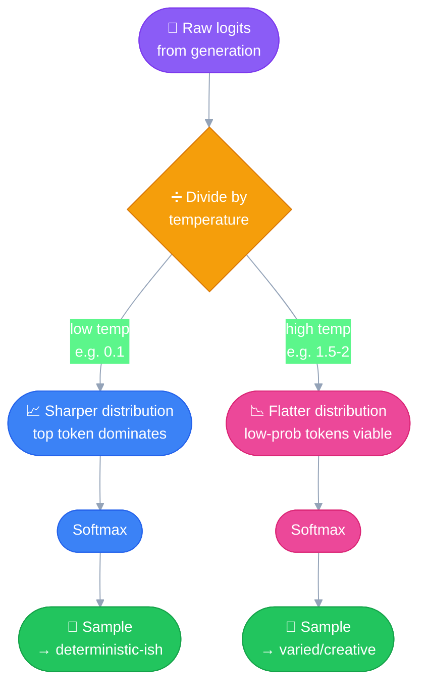

# Temperature
---

**Temperature** — how much randomness we want in the output.

## Recap: where this sits in the pipeline

Same transformer pipeline from
[Accessing the API](01_accessing_the_api.md), for context:

**Tokenization → Embedding → Positional Encoding → Self-Attention
(Contextualization) → Generation → Softmax → Sampling**

Temperature acts at the very last step — **sampling** — after the input
has already been fully processed. It doesn't touch tokenization,
embedding, or attention at all; it only shapes *how the final token gets
picked* from the probabilities the model already computed.

## The actual mechanism

The generation step produces a raw score (**logit**) for every possible
next token — not yet a probability. **Temperature divides those logits
before softmax converts them into a probability distribution:**

```
adjusted_logit = logit / temperature
```

This division is *why* low vs. high temperature behaves the way it
does:

- **Low temperature** (e.g. 0.1) — dividing by a small number
  **stretches apart** the differences between logits, so after softmax
  the already-most-likely token becomes even more dominant. Sharper,
  more deterministic distribution.
- **High temperature** (e.g. 1.5–2, on providers that allow it) —
  dividing by a large number **shrinks** the differences between
  logits, so after softmax the probabilities flatten out and even
  low-probability tokens get a real shot. More varied/creative
  distribution.



## Confirmed behavior

| | Low Temperature | High Temperature |
|---|---|---|
| Distribution shape | Sharper, peaked | Flatter |
| Most likely token | Even more dominant | Less dominant |
| Low-probability tokens | Rarely chosen | Real chance of being chosen |
| Output character | More deterministic | More creative/varied |

> [!IMPORTANT]
> ### Anthropic's temperature range is 0 to 1 — not 0 to 2
> Some other providers (e.g. OpenAI) allow a 0–2 range. Anthropic's API
> caps at 1. Worth keeping straight since the groupings below assume
> the 0–1 scale.

## Practical mapping: temperature by use case

| Range | Band | Use cases |
|---|---|---|
| **0.0 – 0.3** | 🧊 Low | Factual responses, coding assistance, data extraction, content moderation |
| **0.4 – 0.7** | 🌤️ Medium | Summarization, educational content, problem-solving, creative writing with constraints |
| **0.8 – 1.0** | 🔥 High | Brainstorming, creative writing, marketing content, joke generation |

**The underlying logic:** low temperature suits tasks with **one
"correct" or clearly-best answer** — a fact, a working piece of code, an
extracted data value — where variation is a bug, not a feature. High
temperature suits tasks where **multiple good answers exist** and
variety/novelty is actually the goal. Medium sits in between: enough
structure to stay coherent and on-task, enough freedom to not sound
robotic (e.g. summarizing without just parroting word-for-word, or
creative writing that still respects given constraints).
