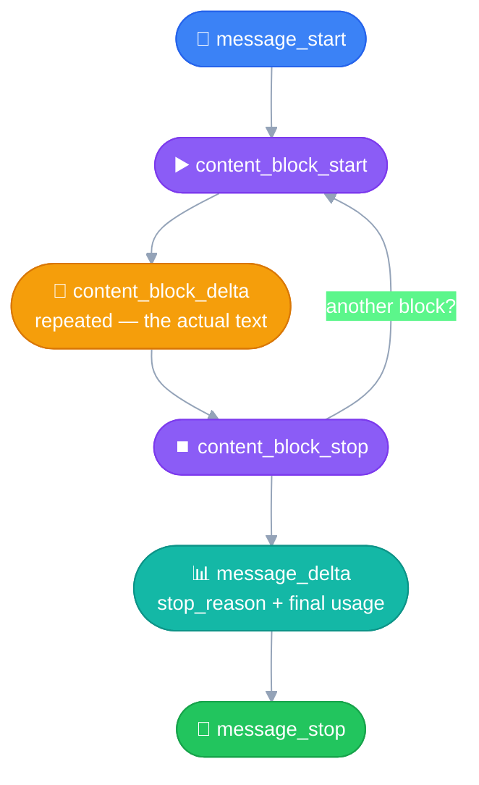

# Streaming
---

## The problem

A normal API call is a typical HTTP request/response: send it, wait for
the *entire* response to finish generating, then get it all back at
once. If generation takes 10-30 seconds, the user stares at a blank
loading state the whole time.

**Streaming** sends the response in small chunks — whatever's been
generated so far — as it's produced, instead of waiting for the whole
thing. Same total generation time under the hood; the UX just stops
feeling dead.

> [!TIP]
> ### 📺 Real-world analogy
>  
>
> Video streaming apps don't make you download the entire video before
> playback starts — they send it as small chunks (segments) delivered
> progressively, so you're watching before the whole file has arrived.
> Same core principle as LLM streaming: **don't make the consumer wait
> for the entire payload before showing anything** — just applied to
> generated text instead of video data.

## The event sequence



| Event | What it carries |
|---|---|
| `message_start` | The initial `Message` shell — `usage.input_tokens` is already set here |
| `content_block_start` | Signals a content block is beginning (has an `index`, a block `type`) |
| `content_block_delta` *(repeated)* | The actual generated text, arriving in small pieces |
| `content_block_stop` | This block is complete |
| `message_delta` | `stop_reason`, `stop_sequence`, and the **final `usage`** — see below |
| `message_stop` | End of stream |

> [!NOTE]
> ### Multiple content blocks are possible, not just one
> The `content_block_start → delta(s) → stop` cycle repeats **once per
> block**, each tagged with its own `index` — e.g. a `thinking` block
> followed by a `text` block, or several `tool_use` blocks for function
> calling. A simple text-only response is just the single-block case.

> [!TIP]
> ### `ping` events show up too — they're not a bug
> Periodic keep-alive events with no content, sent to prevent the
> connection timing out during long generations. Filtering the raw
> event stream for meaningful events means skipping these.

## `message_delta`'s actual `usage` structure — verified from a real run

Captured directly from a live response, not assumed:

```python
RawMessageDeltaEvent(
    delta=Delta(container=None, stop_details=None, stop_reason='end_turn', stop_sequence=None),
    type='message_delta',
    usage=MessageDeltaUsage(
        cache_creation_input_tokens=0,
        cache_read_input_tokens=0,
        input_tokens=22,
        output_tokens=717,
        output_tokens_details=OutputTokensDetails(thinking_tokens=0),
        server_tool_use=None
    )
)
```

| Field | What it is |
|---|---|
| `usage.input_tokens` | Input token count — **present here**, not exclusive to `message_start` |
| `usage.output_tokens` | Output tokens generated |
| `usage.cache_creation_input_tokens` | Tokens written to cache (0 = no caching used) |
| `usage.cache_read_input_tokens` | Tokens read from cache |
| `usage.output_tokens_details.thinking_tokens` | Tokens spent on extended thinking specifically |
| `usage.server_tool_use` | Server-side tool usage details, if any |
| `delta.stop_reason` | Why generation stopped (`end_turn`, etc.) |

Accessed as attributes (`event.delta.stop_reason`, `event.usage.output_tokens`), not dict keys — these are typed SDK objects.

## Two ways to consume a stream

**1. Raw event iteration** — see every event type as it arrives:
```python
for event in client.messages.create(..., stream=True):
    print(event.type)
```
Useful for understanding the protocol (this is the inspection pattern
used to capture the `message_delta` structure above), but the raw text
is scattered across many `content_block_delta` events — not convenient
for actually displaying a growing response.

**2. The `text_stream` helper** — the practical pattern. It already
filters down to just the text deltas, concatenated as they arrive —
this is what actually produces the live "typing" effect. Full example
below.

## The practical pattern: live text, then clean formatting

`get_final_message()` (called *after* the loop finishes) gives back the
complete, assembled `Message` — same shape as a normal non-streaming
response, so `final_message.content` processes exactly like
`response.content` from a regular call.

```python
with client.messages.stream(model=model, max_tokens=1024, messages=messages) as stream:
    for text in stream.text_stream:
        print(text, end="")          # live, raw, streams line by line

    final_message = stream.get_final_message()

clear_output(wait=True)               # wipe the raw streaming text

text_blocks = [block.text for block in final_message.content if block.type == "text"]
response_text = "\n".join(text_blocks)
display_turn("Assistant", response_text)   # clean, rendered Markdown
```

The user sees natural, incremental progress while generation is
happening — then the moment it's done, the raw stream gets replaced
with a properly formatted final answer. Same experience as ChatGPT/
Claude.ai's own chat interfaces.
