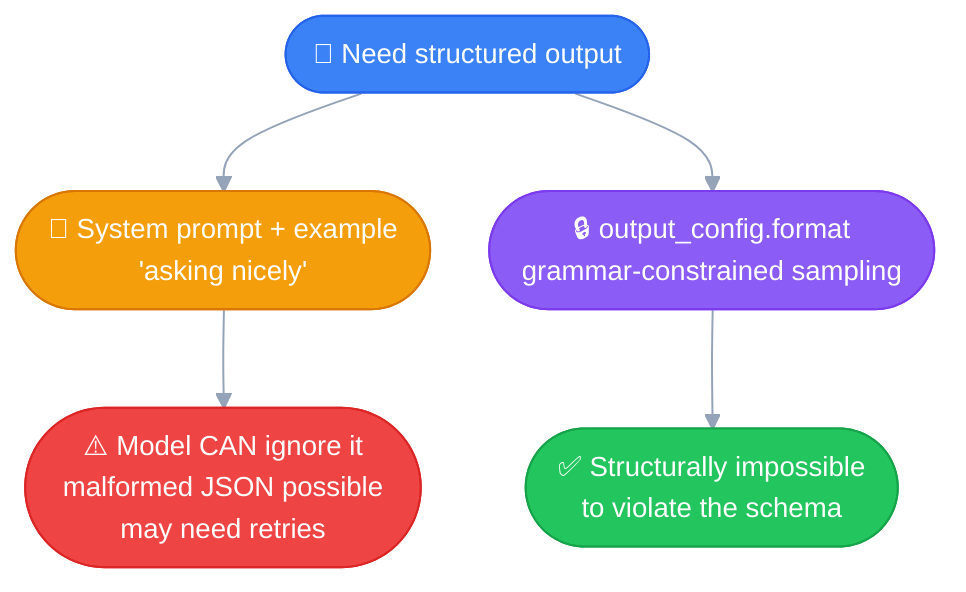

# Structured Outputs
---

## In my own words

This is a new feature that supports JSON-schema-based outputs, with a
guarantee behind it. But for Python or other non-JSON structured
outputs, we still need to go with the default system prompt technique
— prefilling isn't a fallback here, since it's deprecated across the
whole current model generation (Haiku 4.5 included), not just the
newer ones.

## The problem

Applications often need the model's response in a specific machine-
readable shape (JSON for a database record, a fixed set of fields for
a form) — not free-form prose. Two ways to get there, with very
different guarantees.

## Two approaches



### 1. System prompt + example — "asking nicely"

Instruct the model on the exact shape expected, with a worked example,
in the system prompt (see [System Prompts](03_system_prompts.md)).
Works on any model, but it's guidance, not enforcement — the model
*can* ignore it, drop a field, or produce malformed JSON. `json.loads()`
can fail.

### 2. `output_config.format` — the real "Structured Outputs" feature

A first-class API capability using **grammar-constrained sampling**:
the API restricts which tokens the model can even generate next, based
on a formal grammar derived from a JSON schema you provide.

```python
response = client.messages.create(
    model="claude-opus-5",
    max_tokens=1024,
    messages=[{"role": "user", "content": "Generate a dummy user profile"}],
    output_config={
        "format": {
            "type": "json_schema",
            "schema": {
                "type": "object",
                "properties": {
                    "id": {"type": "integer"},
                    "firstName": {"type": "string"},
                    "lastName": {"type": "string"},
                    "email": {"type": "string"}
                },
                "required": ["id", "firstName", "lastName", "email"],
                "additionalProperties": False
            }
        }
    }
)
```

**Bonus — typed helper via Pydantic**, avoids hand-writing raw JSON
Schema:
```python
from pydantic import BaseModel

class UserProfile(BaseModel):
    id: int
    firstName: str
    lastName: str
    email: str

response = client.messages.parse(
    model="claude-opus-5",
    output_format=UserProfile,
    messages=[...]
)
response.parsed_output   # a typed UserProfile instance, not a raw dict
```

### The actual guarantee, side by side

| | System prompt | `output_config.format` |
|---|---|---|
| Validation | None — Claude *can* ignore it | **Guaranteed**, via grammar-constrained sampling |
| Malformed JSON | Possible | **Impossible** — always matches the schema |
| Required fields | Can be silently dropped | **Enforced** |
| Retries for failures | Sometimes needed | **Never needed** |

> [!IMPORTANT]
> ### `output_config.format` is JSON-schema only
> There's no equivalent format type for non-JSON structured output —
> e.g. "guaranteed valid Python/Java code." The mechanism relies on
> constraining against JSON's simple, well-defined grammar; a
> programming language's grammar is far more complex, and "valid" for
> code means more than syntax (it has to actually run correctly), so
> there's no off-the-shelf equivalent guarantee.
>
> Support in other SDKs (e.g. Java's `outputConfig(Class<T>)`) is about
> **defining the schema conveniently** from a native class — the actual
> output is still JSON either way, not generated Java code.

## Non-JSON structured output (e.g. code)

No guaranteed mechanism exists — two practical options:

1. **Wrap it in a JSON schema field** — e.g. `{"language": "python",
   "code": "..."}`. Guarantees valid *JSON*; the `code` string itself
   is unvalidated free text, no guarantee it's syntactically correct.
2. **Validate after the fact** — run the generated code through an
   actual linter/compiler/AST parser, or execute it in a sandbox. Same
   "layered defense" idea as guardrails: the model's output isn't the
   last line of defense, a real verification step is.

**Bottom line: for non-JSON structured output, the system prompt +
example technique is the correct current approach** — not a fallback.

## A dead end worth knowing about: prefilling

Older technique: seed the assistant's turn with a partial string (e.g.
`"{"`) so the model continues from there, forcing it into a shape.
**Deprecated** — returns a 400 error on current models.

> [!WARNING]
> ### Prefilling's cutoff is different from temperature's — and wider
> Temperature is deprecated starting **Opus 4.7 / Sonnet 5** — Haiku
> 4.5 still supports it. Prefilling is deprecated across the **entire
> Claude 4.5/4.6+ generation, Haiku included** — only pre-4.5 models
> (Claude 3.5 series) still support it. Don't assume "drop to Haiku"
> fixes a deprecated-feature problem in general — check each feature's
> own cutoff.

| Feature | Still works on Haiku 4.5? | Deprecated starting |
|---|---|---|
| Temperature | ✅ Yes | Opus 4.7 / Sonnet 5 |
| Prefilling | ❌ No | The whole 4.5/4.6+ generation |

## Quick recap

| Need | Use |
|---|---|
| JSON, guaranteed valid | `output_config.format` (or `.parse()` + Pydantic/Zod) |
| JSON, quick/model-agnostic, retries acceptable | System prompt + example |
| Non-JSON (code, custom format) | System prompt + example, then validate the output separately |
| ~~Prefilling~~ | Deprecated on all current models (4.5/4.6+) — don't use |
