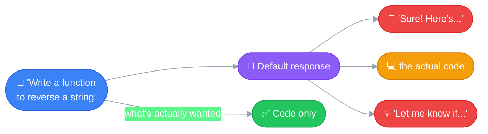
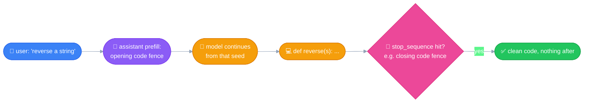

# Structured Outputs
---

## The default problem

Left alone, an LLM naturally responds in prose — sentences, paragraphs,
markdown-ish lists. Fine for a chat, but a problem for a **coding
agent** that needs *only* code: the model tends to wrap it in
greetings, explanations, and follow-up suggestions.



## Old fix (now deprecated): prefill + `stop_sequence`

- **Prefill** — seed the assistant's turn with tokens already "said"
  (e.g. an opening code fence), so the model continues straight into
  code instead of starting with a greeting.
- **`stop_sequence`** — tells the model where to stop (e.g. a closing
  fence), cutting off any trailing explanation.

Together: clean, code-only output.



> [!WARNING]
> ### Deprecated — don't use on current models
> Returns a 400 error across the **entire Claude 4.5/4.6+ generation,
> Haiku 4.5 included** — only pre-4.5 models (Claude 3.5 series) still
> support it. Its cutoff is wider than temperature's (which Haiku 4.5
> still supports) — check each feature's own cutoff, don't assume
> "drop to a smaller model" fixes a deprecated feature in general.

## Modern fix #1: system prompt + example — works for *any* format

Same technique as [System Prompts](03_system_prompts.md): a persistent
instruction + a worked example shapes the output shape. Works for
**any** target format — JSON, code, a custom layout — and on every
current model. It's the correct current approach for non-JSON
structured output, not a fallback.

**The tradeoff:** it's *guidance*, not enforcement. The model can still
ignore it, drop a field, or hand back something slightly off.

## Modern fix #2: `output_config.format` — guaranteed, JSON only

A first-class API feature using **grammar-constrained sampling**: the
API restricts which tokens the model can even generate next, based on
a schema you provide. Not prompting — an actual structural constraint.

```python
response = client.messages.create(
    model="claude-opus-5",
    max_tokens=1024,
    messages=[{"role": "user", "content": "Generate a dummy user profile"}],
    output_config={
        "format": {
            "type": "json_schema",
            "schema": {
                "type": "object",
                "properties": {
                    "id": {"type": "integer"},
                    "firstName": {"type": "string"},
                    "lastName": {"type": "string"},
                    "email": {"type": "string"}
                },
                "required": ["id", "firstName", "lastName", "email"],
                "additionalProperties": False
            }
        }
    }
)
```

**Typed helper via Pydantic**, avoids hand-writing raw JSON Schema:
```python
from pydantic import BaseModel

class UserProfile(BaseModel):
    id: int
    firstName: str
    lastName: str
    email: str

response = client.messages.parse(
    model="claude-opus-5",
    output_format=UserProfile,
    messages=[...]
)
response.parsed_output   # a typed UserProfile instance, not a raw dict
```

| | System prompt | `output_config.format` |
|---|---|---|
| Validation | None — Claude *can* ignore it | **Guaranteed**, grammar-constrained |
| Malformed JSON | Possible | **Impossible** |
| Required fields | Can be silently dropped | **Enforced** |
| Retries for failures | Sometimes needed | **Never needed** |
| Format | Any | **JSON only** |

> [!IMPORTANT]
> ### No equivalent guarantee exists for code
> JSON has a simple, well-defined grammar — easy to constrain against.
> A programming language's grammar is far more complex, and "valid"
> for code means more than syntax (it has to actually run correctly).
> If code correctness matters: wrap it in a JSON field (guarantees the
> *wrapper* is valid JSON, not that the code inside compiles), or
> validate it after generation — a linter, compiler, or sandboxed
> execution. Same "layered defense" idea as guardrails: the model's
> output isn't the last line of defense, a real check is.

## Feature support cutoffs — don't assume they line up

| Feature | Still works on Haiku 4.5? | Deprecated starting |
|---|---|---|
| Temperature | ✅ Yes | Opus 4.7 / Sonnet 5 |
| Prefilling | ❌ No | The whole 4.5/4.6+ generation |

## Quick recap

| Need | Use |
|---|---|
| JSON, guaranteed valid | `output_config.format` (or `.parse()` + Pydantic/Zod) |
| JSON, quick/model-agnostic, retries acceptable | System prompt + example |
| Non-JSON (code, custom format) | System prompt + example, then validate separately |
| ~~Prefilling~~ | Deprecated everywhere current — don't use |
