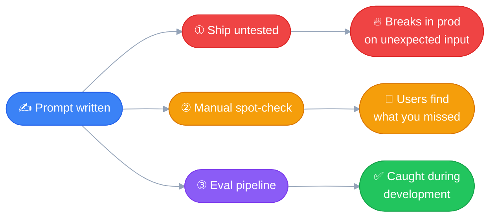

# Prompt Evaluation
---

*Definitions only for now — the deeper mechanics (grading methods,
building an actual eval pipeline) come later in the course as their
own topics.*

## Prompt Engineering

Techniques that help you write effective, better prompts — so Claude
understands exactly what you're asking for, and how you want it to
respond.

## Prompt Evaluation

But how do you actually measure whether a prompt is effective and
well-written? That's what **prompt evals** are for: an automated test
to measure how well a prompt works.

What it does:
- Tests against expected answers
- Compares different versions of the same prompt
- Reviews outputs for errors

> **Together:** prompt engineering + prompt evaluation = *building
effective prompts, and testing how they perform.*

## What to do once a prompt is written

| Option | Approach | Risk |
|---|---|---|
| 1 | Test once, ship to production | An unexpected user input breaks production |
| 2 | Test with ~4-5 use cases + edge cases, then wait | Still relies on real users to surface what wasn't covered |
| 3 | Build an eval pipeline, score it, iterate | More upfront work — but reliable, and scales |

## Option 3: the evaluation-first approach

- Identify weaknesses before they become production issues
- Compare different prompt versions objectively
- Iterate with confidence, based on measurable improvements
- Build more reliable AI applications

> **The goal:** catch problems during development — not after users
encounter them.
