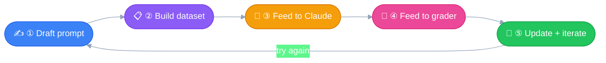
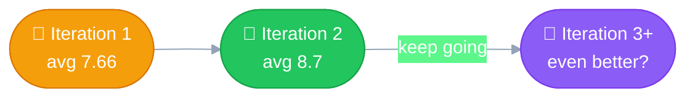

# 🔁 Prompt Evals Workflow
---

Five steps that turn "I think this prompt is pretty good" into **a
number you can actually trust.** No more guesswork — just measurable,
repeatable improvement.

Companion to [07_prompt_evaluation.md](07_prompt_evaluation.md) — this
is that concept, turned into an actual repeatable loop.

## 🌀 The Loop, at a Glance



## ✍️ Step ①: Draft an Initial Prompt

Just write the thing. This is your baseline — it doesn't need to be
perfect, it needs to *exist* so there's something to measure.

```python
prompt = f"""
Please answer the user's question:

{question}
"""
```

## 📋 Step ②: Define the Eval Dataset

The set of inputs your prompt will actually face in production — the
math questions, the weird edge cases, all of it. Can be hand-picked or
Claude-generated; from a handful to thousands of rows.

> [!NOTE]
> ### 📚 The example dataset
> - `"What's 2+2?"` 🧮
> - `"How do I make oatmeal?"` 🥣
> - `"How far away is the Moon?"` 🌕

### 🏗️ Two ways to actually build the dataset

| Method | What it means | Tradeoff |
|---|---|---|
| 🧑 Human-written | Someone hand-writes each test case | Careful and realistic, but slow and tedious — doesn't scale |
| 🤖 Model-generated | A fast model (e.g. Haiku) generates the test cases for you | Quick, scales easily — exactly the approach used in [08_prompt_evals_exercise.ipynb](notebooks/08_prompt_evals_exercise.ipynb)'s `generate_dataset()` |

## 🚀 Step ③: Feed to Claude

Merge each dataset row into the prompt template, send it, capture the
response.

| Question | Claude's response |
|---|---|
| 🧮 What's 2+2? | "2 + 2 = 4" |
| 🥣 How do I make oatmeal? | *(cooking instructions)* |
| 🌕 How far away is the Moon? | *(the distance)* |

## 🎯 Step ④: Feed to a Grader

Both the **original question** and **Claude's response** go to a
grader — something that scores the answer's quality, typically **1–10**
(10 = perfect).

| Question | Score |
|---|---|
| 🧮 Math | **10** — perfect |
| 🥣 Oatmeal | **4** — needs work |
| 🌕 Moon | **9** — very good |

**Average: (10 + 4 + 9) ÷ 3 = 7.66** — that's your objective baseline. 📊

> [!TIP]
> ### 🏅 Bonus concept: the "golden answer"
> Not covered in depth yet, but worth knowing the term — a **golden
> answer** is a reference/example of a perfect response the grader
> compares against, instead of judging from scratch every time.
> Sometimes it's a strict exact-match, sometimes just a calibration
> example. More on this later in the course.

### ⚖️ Three types of graders

| Grader | How it works | Good for | Tradeoff |
|---|---|---|---|
| 🖥️ **Code Grader** | Code/functions check the output directly | Syntax correctness, does it parse (JSON/XML), length limits, disallowed words | Fast and deterministic, but rigid — only catches what you explicitly coded a check for |
| 🧠 **Model Grader** | Another model evaluates the output, acting as a judge | Is it *helpful*, does it hold up under tricky/breaking scenarios — dynamic, not just rule-checking | This is exactly what [`grade_by_model()`](notebooks/08_prompt_evals_exercise.ipynb) does in the exercise notebook |
| 🧑 **Human Grader** | A person reviews the output | The real gold standard for nuance and correctness | Time-consuming and tedious — doesn't scale |

## 🔧 Step ⑤: Update the Prompt and Iterate

Look at the weak spot (👀 that oatmeal score), tweak the prompt, run
the *whole loop* again.

```python
prompt = f"""
Please answer the user's question:

{question}

Answer the question with ample detail
"""
```



**7.66 → 8.7** — a measurable win, not a vibe. 🎉

## 🛠️ Tooling

You don't have to build this loop from scratch every time — open-
source and paid tools exist to assemble it, e.g. **LangSmith**.

## 🏆 Prompt Scoring

Once you've got numbers, comparing prompt versions stops being a guess:

- 📈 Compare different prompt versions **numerically**
- 🥇 Use the version with the **best score**
- 🔁 Keep iterating to find even better approaches

**The real win:** this whole loop **removes guesswork** — you're not
going by gut feeling on which version is better, you have a number. 🔢
