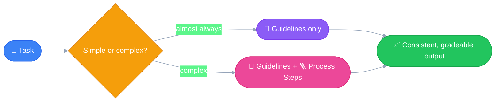
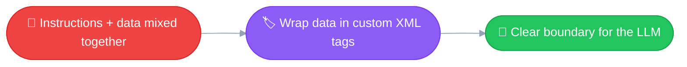
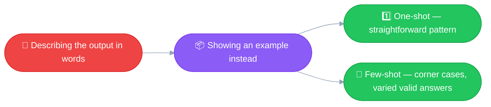

# 🛠️ Prompt Engineering Techniques
---

One file, every technique — easier to scan, easier to compare, and it
keeps related content on a single page instead of scattered across
files. Companion to the cycle in [09_prompt_engineering.md](09_prompt_engineering.md).

---

## 💥 1. Simple + Direct

Two moves that travel together. Being **simple** without being
**direct** just gets you a clean but vague prompt. Being **direct**
without being **simple** buries the instruction in jargon. You need
both. 🤝

*(Tags in `code` at the end of each line are mine — my own memory
hooks, not official terminology.)*

- 🧼 Keep the language for your prompt simple `(Simple)`
- 🎯 Explicitly state what the task is for the LLM `(Explicit)`
- ✂️ Keep the first line crisp and clear `(First Line Principle)`
- 🗣️ Be direct — give the LLM instructions, not questions `(Direct)`
- 🏃 Use action verbs to highlight the task `(Action verbs)`

### 🔬 Examples

**Example 1**
```
Instead of:
"I need to know about those things people put on their roofs that use sun - those solar panel
things, I think they're called"

Use: "Write three paragraphs about
how solar panels work"
```

**Example 2**
```
Instead of: "I was reading about renewable energy and geothermal energy sounds neat. What countries
use it?"

Use: "Identify three countries that use geothermal energy. Include
generation stats for each."
```

Notice the pattern in both: the "instead of" version **rambles toward**
the ask — you don't know what's actually being requested until the very
end, if at all. The fixed version **leads with an action verb** (`Write`,
`Identify`) and states the exact deliverable up front. That's *Simple*,
*Explicit*, *First Line*, *Direct*, and *Action verbs* — all five moves,
in one sentence. 🎯


Same story as your own Hindi-translation exercise — this isn't a vibe,
it's a **measured** improvement. 📊

---

## 🔍 2. Be Specific

Without clear guidelines, an LLM can go in **infinite directions** — or
more precisely, it just goes with whichever direction scored best
during the sampling process. 🎲 Being specific is how you pin that down
to *the* direction you actually wanted.

### 🧩 Two Types of Guidelines

- 📐 **Guidelines** — control the *quality* or *format* of the output
  - ✂️ Limit on the length of the response
  - 🧱 Structure or format of the output
  - 🏷️ Specific attributes to include
  - 🎭 Tone or style
- 🪜 **Process Steps** — a step-by-step plan for the LLM to follow
  - Used for a complex problem, or when you want the LLM to follow a
    **specific sequence of steps** to generate the output

### 🤔 When to Use Which

- 📐 For almost every case — use Guidelines to define the quality of
  the output.
- 🪜 For complex problems — include Process Steps.
- 🤝 In general, developers prefer using both hand in hand for better
  results.



**In my own words:** Guidelines shape *what the output looks like* —
the destination. Process Steps shape *how the LLM gets there* — the
route. Most prompts only need the destination defined; the route only
matters once the problem is complex enough that the LLM might take a
bad path getting there.

---

## 🏷️ 3. Use Delimiters

**Main motivation:** in a prompt, always try to keep the data or content
**separate from the instructions**. This gives the LLM a clear boundary
between "here's what to do" and "here's what to do it on." Custom XML
tags are one way to draw that boundary.

### 🤷 When it matters most vs. least

- It matters **most** once a prompt gets complex — mixed content types
  (code, docs, structured data), or variables getting interpolated
  into the middle of instructions, where the LLM can lose track of
  which text belongs together.
- It matters **less** for a quick, simple prompt — the quality upside
  is modest there.

**My take:** I'd use delimiters always, even in simple prompts. It might
not move the quality needle much on a simple prompt, but it costs
nothing and keeps the prompt clean and maintainable as a habit — so
when a prompt *does* grow complex later, the separation is already
there.



---

## 📦 4. Providing Examples

**Main motivation:** give the LLM an idea of what an ideal output
*looks like*, instead of just describing it. To improve results, or
for complex problems, it's useful to provide example input/output
pairs.

- 1️⃣ **One-shot prompting** — a single example of the input/output pair
- 🔢 **Few-shot / multi-shot prompting** — multiple examples, used to
  cover corner cases

This is something I already tried, without naming it, in the Hindi
translation exercise — a real one-shot example straight from my own
system prompt in [03_system_prompts.ipynb](notebooks/03_system_prompts.ipynb):

```
Example:
What is hello in hind? Here user is expecting a response like below
Hello - नमस्ते/नमस्कार
```

One example was enough there to lock in the output *format* (word —
translation) that carried consistently across every turn of the
conversation, including turns translating full sentences instead of
single words.



---

*(New techniques get appended here as we cover them — one page, easy to
scan and compare across techniques.)*
