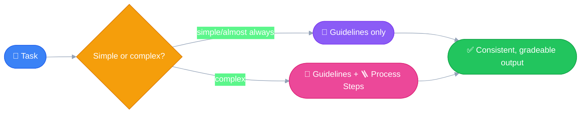

# 🔍 Be Specific
---

Without clear guidelines, an LLM can wander in **infinite directions**
— or more precisely, it just goes with whichever direction scored best
during the sampling process. 🎲 Being specific is how you narrow that
down to *the* direction you actually wanted.

## 🧩 Two Types of Guidelines

- 📐 **Guidelines** — control the *quality* or *format* of the output
  - ✂️ Limit on the length of the response
  - 🧱 Structure or format of the output
  - 🏷️ Specific attributes to include
  - 🎭 Tone or style
- 🪜 **Process Steps** — a step-by-step plan for the LLM to follow
  - Used for a complex problem, or when you want the LLM to follow a
    **specific sequence** of steps to generate the output

## 🤔 When to Use Which

| Situation | Use |
|---|---|
| Almost every prompt | 📐 Guidelines — define the quality of output |
| Complex problems, decision-making, critical thinking | 🪜 Process Steps |
| Real-world / professional prompts | 🤝 Both, hand in hand — best results |



## 🔬 Examples

### 📐 Guidelines — meal planning

```
Guidelines:
1. Include accurate daily calorie amount
2. Show protein, fat, and carb amounts
3. Specify when to eat each meal
4. Use only foods that fit restrictions
5. List all portion sizes in grams
6. Keep budget-friendly if mentioned
```

### 🪜 Process Steps — short story writing

Instead of jumping straight to writing a story, you might ask Claude
to work through it in stages first:

```
1. Brainstorm three talents that would create dramatic tension
2. Pick the most interesting talent
3. Outline a pivotal scene that reveals the talent
4. Brainstorm supporting character types that could increase the impact
```

Notice what each type is actually doing: Guidelines shape *what the
output looks like* (calories, grams, format). Process Steps shape *how
the LLM gets there* (brainstorm → pick → outline → expand). One
controls the destination, the other controls the route. 🗺️

## 📈 Proof it moves the needle

Same meal-planning prompt from [Simple + Direct](10_simple_and_direct.md)
— adding the Guidelines above on top of it pushed the evaluation score
from **3.92 → 7.86**, more than doubling the quality (same 1–10 scale
from [Prompt Evals Workflow](08_prompt_evals_workflow.md)).

> [!NOTE]
> ### 📚 Source
> [Being specific — Claude Academy](https://academy.claude.com/courses/building-with-the-claude-api/being-specific)
