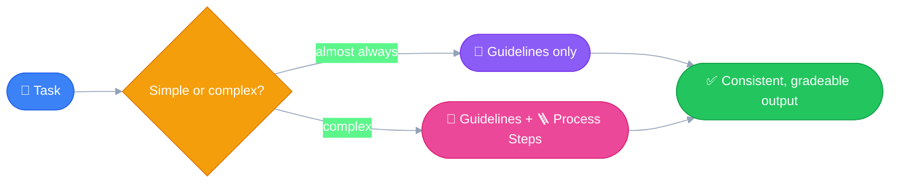

# 🔍 Be Specific
---

Without clear guidelines, an LLM can go in **infinite directions** — or
more precisely, it just goes with whichever direction scored best
during the sampling process. 🎲 Being specific is how you pin that down
to *the* direction you actually wanted.

## 🧩 Two Types of Guidelines

- 📐 **Guidelines** — control the *quality* or *format* of the output
  - ✂️ Limit on the length of the response
  - 🧱 Structure or format of the output
  - 🏷️ Specific attributes to include
  - 🎭 Tone or style
- 🪜 **Process Steps** — a step-by-step plan for the LLM to follow
  - Used for a complex problem, or when you want the LLM to follow a
    **specific sequence of steps** to generate the output

## 🤔 When to Use Which

- 📐 For almost every case — use Guidelines to define the quality of
  the output.
- 🪜 For complex problems — include Process Steps.
- 🤝 In general, developers prefer using both hand in hand for better
  results.

## 💡 The distinction, in my own words

Guidelines shape *what the output looks like* — the destination.
Process Steps shape *how the LLM gets there* — the route. Most prompts
only need the destination defined; the route only matters once the
problem is complex enough that the LLM might take a bad path getting
there.
